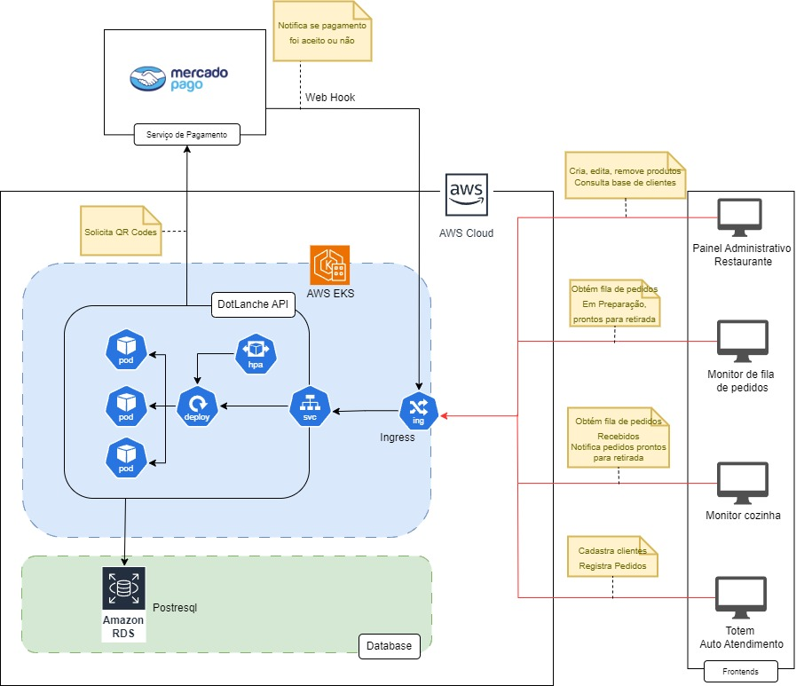
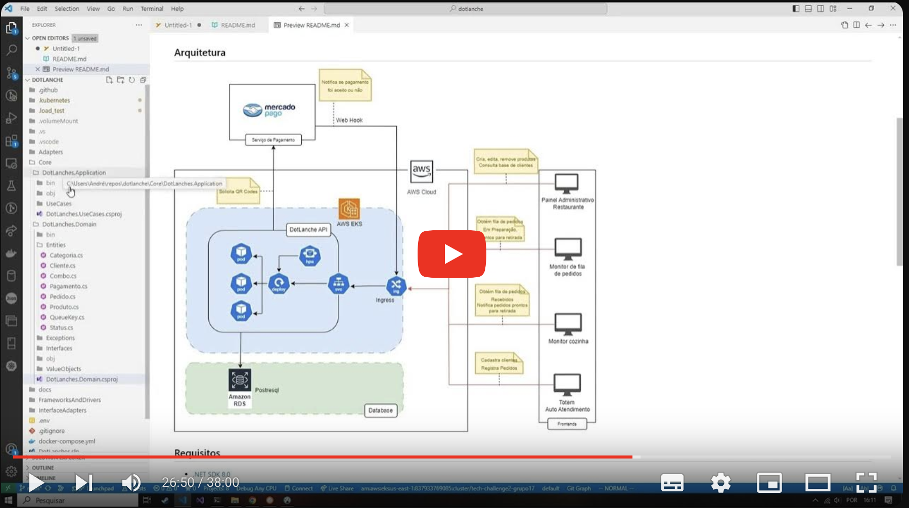

# DotLanche :hamburger:

## Descrição do Projeto

O DotLanche é uma aplicação para gerenciamento de clientes e pedidos em um sistema de lanchonete. A aplicação é construída usando .NET e utiliza um banco de dados PostgreSQL. O projeto inclui arquivos de configuração do Docker para facilitar o desenvolvimento e a implantação.

## Objetivos

- Gerenciar clientes, produtos e pedidos.
- Facilitar o controle de estoque.
- Automatizar processos de venda e registro de clientes.
- Fornecer uma interface de API para interagir com o sistema.

## Estrutura do Projeto

- **DotLanches.Api**: Contém a API da aplicação.
- **DotLanches.Application**: Contém as regras de negócio e serviços da aplicação.
- **DotLanches.Domain**: Contém as entidades e exceções do domínio.
- **DotLanches.Infra**: Contém a camada de infraestrutura, como repositórios e configuração do banco de dados.

## Arquitetura


## Requisitos

- [.NET SDK 8.0](https://dotnet.microsoft.com/download)
- [Docker](https://www.docker.com/get-started)
- [Docker Compose](https://docs.docker.com/compose/install/)

## Configuração do Ambiente

1. Clone o repositório
   ```sh
   git clone https://github.com/lanchesjaamp/dotlanche.git
   cd dotlanche

2. Execute a Aplicação com Docker Compose
   ```sh
   docker-compose build
   docker-compose up

3. Abra no navegador a API pela rota http://localhost:8080/swagger/index.html

## Orderm de execução dos endpoints
- A seguir segue a ordem de execução dos enpoints para o uso correto da aplicação, para mais detalhes, como corpo das requisições, pode se verificar no [collection](https://github.com/lanchesjaamp/dotlanche/blob/main/docs/postman_collection/DotLanche.postman_collection.json)

### 1. Cadastro de produto
1. Executar uma requisição `POST` para o endpoint `{{API_URL}}/Produto` para criar 1 produto
   - Para verificar as categorias de produto pode executar uma requisição `GET` para o endpoint `{{API_URL}}/Categoria`

### 2. Cadastro de cliente
1. Executar uma requisição `POST` para o endpoint `{{API_URL}}/Cliente` para criar 1 cliente

### 3. Cadastro de pedido
1. Executar uma requisição `GET` para o endpoint `{{API_URL}}/Produto/?idCategoria=<idCategoria>` para consultar os produtos de uma categoria
2. Executar uma requisição `POST` para o endpoint `{{API_URL}}/Pedido` para criar 1 pedido
   - Necessário informar o CPF do cliente cadastrado no passo anterior

### 4. Passos do pagamento
1. Executar uma requisição `POST` para o endpoint `{{API_URL}}/Pagamento/QrCode` para criar 1 pagamento via QR Code
   - Necessário informar o id do pagamento do item anterior
2. Executar uma requisição `POST` para o endpoint `{{API_URL}}/Pagamento/Confirmar` para confirmar o pagamento
   - Necessário informar o id do pagamento do item anterior
   - Necessário adicionar a flag como `isAccepted` como `true`
3. Executar uma requisição `GET` para o endpoint `{{API_URL}}/Pagamento?idPedido={{idPedido}}` para consultar o status do pedido

### 5. Verificar o andamento do pedido
1. Executar uma requisição `GET` para o endpoint `{{API_URL}}/Pedido/queue` para consultar a fila de pedido
   - A fila irá aparecer apenas pedidos com os status `PRONTO`, `Em preparação`, `Recebido`
   - Ordenação da fila é mais antigos para os mais novos _(FIFO)_
2. Executar uma requisição `PUT` para o endpoint `{{API_URL}}/Pedido/<IdPedido>?StatusId=<StatusId>` para atualizar o status do pedido
   - Os ids do status são
      - 1 - `Confirmado`
      - 2 - `Recebido`
      - 3 - `EmPreparacao`
      - 4 - `Pronto`
      - 5 - `Finalizado`
      - 6 - `Cancelado`

### Pode se verificar todos os enpoints importando o [collection](https://github.com/lanchesjaamp/dotlanche/blob/main/docs/postman_collection/DotLanche.postman_collection.json) e o [environment](https://github.com/lanchesjaamp/dotlanche/blob/main/docs/postman_collection/dotlanche.postman_environment.json) no postman
### Todos os endpoints, _exceto a categoria e o pagamento_, são do tipo CRUD, ou seja, possuem métodos de `UPDATE` e `DELETE` das entidades, podendo ser verificado no [collection](https://github.com/lanchesjaamp/dotlanche/blob/main/docs/postman_collection/DotLanche.postman_collection.json)

## Video de explicação do projeto
[](https://youtu.be/PfyiMBKDJ1Y)